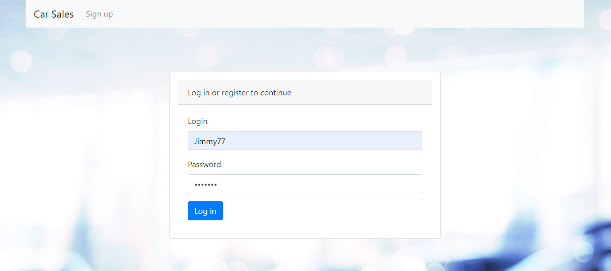
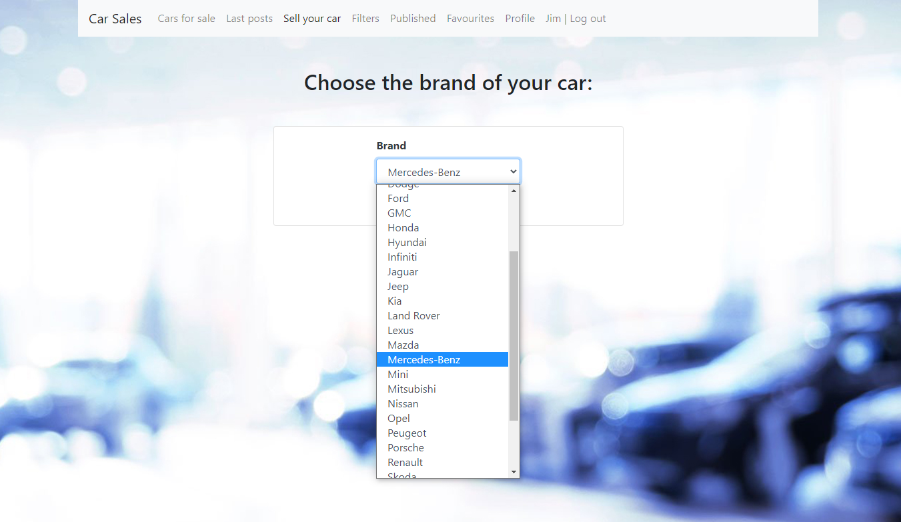

# job4j_cars

This application is a car sales website with car sales posts (ads). 
User can:
- sign up, log in to profile, update profile data
- post, browse, edit, mark as sold or delete his posts (ads).
- add to his favourites another user's posts
- filter posts by various parameters
If the price has changed, it will be shown in the price history.
If the user hasn't added any photos to post, then a picture "photos coming soon" will be added automatically.
Post controls buttons and "Add to favourite" button are available on the view depending on whether the user is the creator of the post (ad).
The publication time is displayed according to the user's time zone.

# Used technologies

Implemented with:
<ul>
 <li>JDK 17</li>
 <li>Maven 3.8.5</li>
 <li>Spring Boot 2.5.2</li>
 <li>JDBC 4</li>
 <li>Lombok 1.18.22</li>
 <li>Bootstrap 4.4.1</li>
 <li>Thymeleaf 2.7.3</li>
 <li>PostgreSQL 42.2.16</li>
 <li>Liquibase 3.6.2</li>
</ul>

# Environment requirements

<ul>
 <li>Create db "cars". Login: postgres, password: password</li>
 <li>Create .jar file via maven command "mvn package"</li>
 <li>Go to the Target folder and check the presence of "job4j_cars-1.0-SNAPSHOT.jar" file</li>
 <li>Open the command line, go to the Target folder</li>
 <li>Run this file through "java -jar job4j_cars-1.0-SNAPSHOT.jar" command</li>
 <li>Then go to the http://localhost:8080/index page</li>
</ul>

# Screenshots

- Sign up page:
  
- Failed sign up:
  
- Successful sign up:
  
- Log in page:
  
- Failed log in:
  
- Index page:
  
- All posts page:
  
- Select brand on car adding page:
  
- Car adding page:
  
- Added post showing page:
  
- Autoadding "photos coming soon" picture if added post don't have any photos:
  
- Added post shows in all posts:
  
- Posts published by user:
  
- Posts added for last day:
  
- Adding another user's post to favourites:
  
- User favourites:
  
- Filters page (every filter works individual):
  
- Posts filtered by SUV body style:
  
- Published post options (relogged as another user):
  
- Post updating page:
  
- Updated post showing page (with price history):
  
- Post marked as sold:
  
- Post options after marked as sold:
  
- All posts after deleting Toyota post:
  
- User profile:
  
- User profile updating page:
  

Contact me: itfedorovsa@gmail.com

